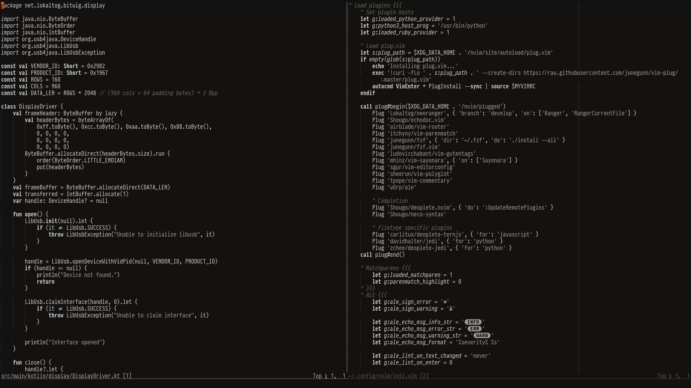
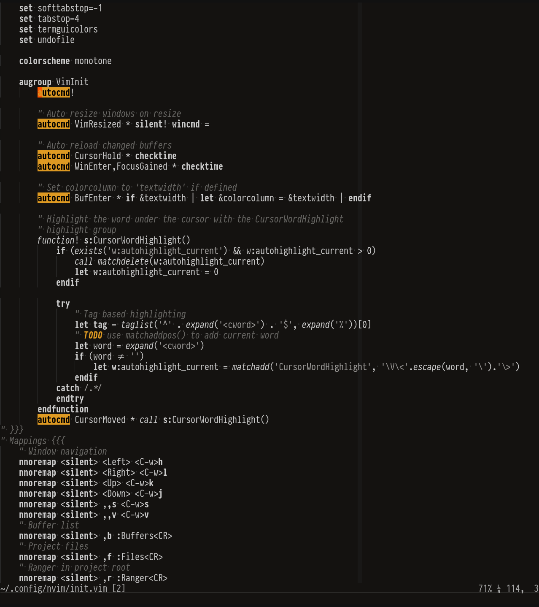
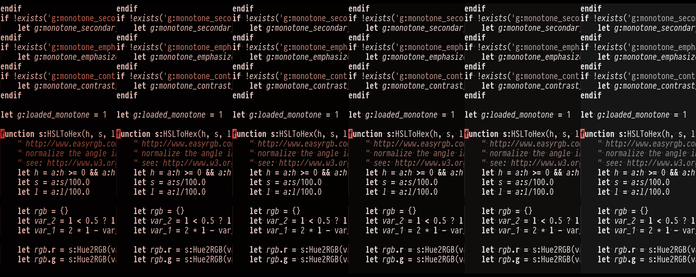
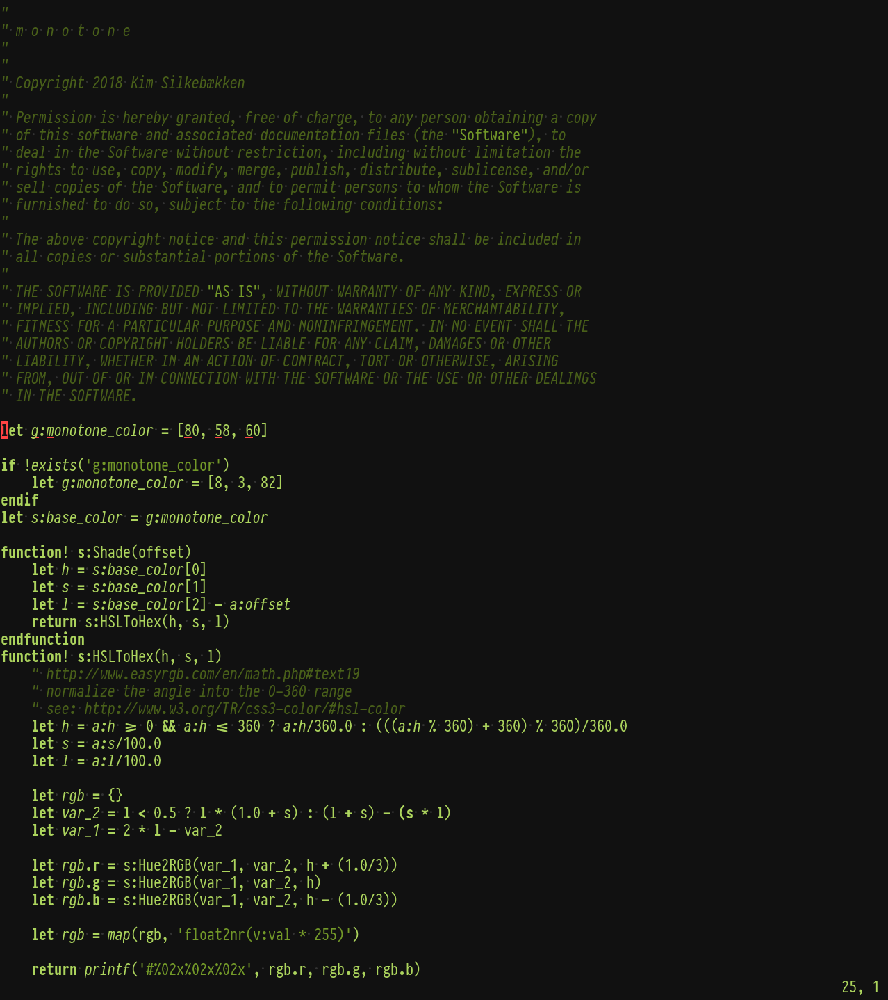

# m o n o t o n e

Another monochrome vim colorscheme. Inspired by various
[other](https://github.com/ewilazarus/preto)
[monochrome](https://github.com/pbrisbin/vim-colors-off)
[colorschemes](https://github.com/fxn/vim-monochrome).

Monotone is a middle ground between a regular colorscheme and [no syntax
highlighting at all](https://www.kyleisom.net/blog/2012/10/17/syntax-off/). The
colorscheme differentiates comments, strings and keywords with different
weights and shades of gray. It emphasizes errors, warnings and search
highlighting as shown in the screenshots below.

## Customization

Theme customizations require a GUI or a terminal emulator with `termguicolors`
set. Otherwise monotone falls back to the default gray theme.
[Kitty](https://github.com/kovidgoyal/kitty) is recommended for full support
for customizations and special styling like underline/undercurl highlighting.

Customization variables must be set before `colorscheme monotone` is executed.

### Monotone command

Monotone defines a `g:Monotone` function with a corresponding `Monotone`
command, which can be used to load the colorscheme with user-defined settings
without setting global config variables. This can be used e.g. for setting
buffer-specific colors or [adjusting colorscheme brightness based on the time
of day](https://github.com/Lokaltog/vim-monotone/wiki/F.lux-like-color-changes).
Examples can be found in the wiki.

Example usage:

```
" Monotone <h> <s> <l> <secondary-hue> <emphasize-comments> <contrast-factor>
" Set the colorscheme to a monochrome beige color:
Monotone 10 25 80 0 0 1
```

### Theme color

The theme color can be customized by setting `g:monotone_color` to an array of
HSL values.

### Secondary colors

Monotone highlights important information in bright colors. The default colors
are bright red, yellow and blue, which are used to highlight stuff like
cursors, search matches and messages. By setting
`g:monotone_secondary_hue_offset` it's possible to offset the secondary colors
to better match a theme color.

### Emphasize comments

Comments are highlighted in a darker color by default. If you prefer to
emphasize comments, set `g:monotone_emphasize_comments` to 1. This will
highlight comments with the warning highlight color (yellow by default).

### Adjust contrast

You may adjust the colorscheme contrast to your liking by setting
`g:monotone_contrast_factor`. The contrast factor only affects dark/background
colors, i.e. different contrast levels are achieved by changing the background
lightness.

The default contrast factor is 1.0. Recommended values are between 0.9 and 1.1.

## Configuration example

```
let g:monotone_color = [120, 100, 70] " Sets theme color to bright green
let g:monotone_secondary_hue_offset = 200 " Offset secondary colors by 200 degrees
let g:monotone_emphasize_comments = 1 " Emphasize comments
colorscheme monotone
```

## Screenshots








